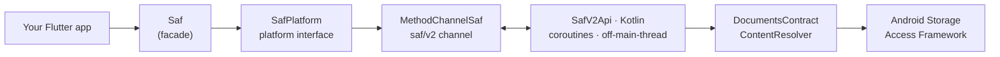

<p align="center">
  <a href="https://jvoltci.github.io/saf/"></a>
</p>

<p align="center">
 <a href="https://pub.dartlang.org/packages/saf">
    
  </a>
  <a href="https://github.com/jvoltci/saf/issues">
  </a>
  
  <a href="https://github.com/jvoltci/saf/actions/workflows/ci.yml">
    
  </a>
</p>

# Saf

One package for the Android Storage Access Framework: pickers, persisted
permissions, file management with recursive walk, streamed read/write with
progress, and local-file bridging — a single `Saf` class that replaces the
`saf_stream` + `saf_util` combination.

## Why saf

| | saf 2.x | saf_stream + saf_util |
| --- | --- | --- |
| Packages needed | **1** | 2 |
| Typed exceptions (`SafNotFoundException`, …) | **yes** | no (raw `PlatformException`) |
| Recursive `walk()` stream | **yes** | no |
| Recursive copy/move with progress callbacks | **yes** | no |
| One-call `writeFileStream` | **yes** | 3-call session dance |
| `isDir` parameters you must supply | **none** | required on most calls |
| List persisted permissions | **yes** | no |
| Dart / Flutter minimum | **3.0 / 3.10** | 3.12 / 3.44 |
| Min Android SDK | 21 | 21 |

## Quick start

```dart
import 'package:saf/saf.dart';

final saf = Saf();

// 1. Ask once — the grant persists across restarts.
final dir = await saf.pickDirectory();
if (dir == null) return; // user cancelled

// Later launches: reuse the grant instead of prompting again.
final grants = await saf.persistedPermissions();

// 2. Manage files.
final files = await saf.list(dir.uri);
final report = await saf.mkdirp(dir.uri, ['reports', '2026']);
await for (final entry in saf.walk(dir.uri)) {
  print(entry.relativePath);
}

// 3. Read and write.
final doc = await saf.writeFileBytes(
    report.uri, 'summary.txt', 'text/plain', utf8.encode('hi') as Uint8List);
final bytes = await saf.readFileBytes(doc.uri);
final stream = await saf.readFileStream(doc.uri); // large files

// 4. Bridge to real file paths when another API needs one.
await saf.copyToLocalFile(doc.uri, '${cacheDir.path}/summary.txt',
    onProgress: (p) => print('${p.bytesDone}/${p.totalBytes}'));
```

Errors are typed — catch what you care about:

```dart
try {
  await saf.delete(uri);
} on SafPermissionException {
  // re-pick the directory
} on SafNotFoundException {
  // already gone
}
```

## Migrating

### From saf 1.x

The old path-based class still works as `LegacySaf` (deprecated, removed in
3.0.0): rename `Saf(` → `LegacySaf(` and migrate at your own pace. The new API
is URI-based — start from `pickDirectory()` and store URIs, not paths.

### From saf_stream / saf_util

Near find-and-replace — method names were kept where sensible:

| saf_stream / saf_util | saf 2.x |
| --- | --- |
| `SafStream().readFileBytes(uri)` | `Saf().readFileBytes(uri)` |
| `SafStream().readFileStream(uri)` | `Saf().readFileStream(uri)` |
| `SafStream().writeFileBytes(dir, name, mime, data)` | `Saf().writeFileBytes(dir, name, mime, data)` |
| `startWriteStream` / `writeChunk` / `endWriteStream` | one call: `Saf().writeFileStream(dir, name, mime, stream)` |
| `SafStream().copyToLocalFile(src, dest)` | `Saf().copyToLocalFile(src, dest)` |
| `SafStream().pasteLocalFile(src, dir, name, mime)` | `Saf().pasteLocalFile(src, dir, name, mime)` |
| `SafUtil().pickDirectory(persistablePermission: …)` | `Saf().pickDirectory(persistablePermission: …)` |
| `SafUtil().pickFile()` / `pickFiles()` | `Saf().pickFile()` / `pickFiles()` |
| `SafUtil().list(uri)` | `Saf().list(uri)` |
| `SafUtil().stat(uri, isDir)` | `Saf().stat(uri)` — no `isDir` needed |
| `SafUtil().exists(uri, isDir)` | `Saf().exists(uri)` |
| `SafUtil().mkdirp(uri, names)` | `Saf().mkdirp(uri, names)` |
| `SafUtil().child(uri, names)` | `Saf().child(uri, names)` |
| `SafUtil().rename(uri, isDir, newName)` | `Saf().rename(uri, newName)` |
| `SafUtil().copyTo(uri, isDir, dest)` | `Saf().copyTo(uri, dest)` — recursive + progress |
| `SafUtil().moveTo(uri, isDir, parent, dest)` | `Saf().moveTo(uri, dest)` |
| `SafUtil().hasPersistedPermission(uri)` | check `Saf().persistedPermissions()` |
| `SafUtil().releasePersistedPermission(uri)` | `Saf().releasePersistedPermission(uri)` |

## What we deliberately don't include (and why)

Public-GitHub usage analysis showed several competitor APIs have ~zero
real-world users, so `saf` keeps its surface small on purpose:

- **Custom read sessions** (`readCustomFileStreamChunk` etc.) — ~4 public
  usages; `readFileStream(start: …)` covers seeking.
- **`readFileSync` / `writeFileSync`** — not actually synchronous; duplicates.
- **`openDirectory` / `openFile` variants** — URI-only duplicates of `pick*`.
- **Media picker** — `image_picker` / `photo_manager` do this better.
- **File descriptors, thumbnails** — niche; file an issue if you need them
  and they'll ship in a 2.1+.

## Architecture

`saf` is a single package with a mockable platform-interface layer, a thin Dart
facade, and one coroutine-based Kotlin handler on a dedicated channel — the
legacy 1.x channels are left untouched.



A typical grant-then-read flow — one permission prompt, reused across restarts:

```mermaid
sequenceDiagram
  participant App
  participant Saf
  participant OS as Android SAF
  App->>Saf: pickDirectory()
  Saf->>OS: ACTION_OPEN_DOCUMENT_TREE
  OS-->>Saf: tree URI (+ persisted grant)
  Saf-->>App: SafDocumentFile
  App->>Saf: list(dir.uri)
  Saf-->>App: List&lt;SafDocumentFile&gt;
  App->>Saf: readFileStream(file.uri)
  Saf-->>App: Stream&lt;Uint8List&gt;
```

## Documentation

- **[Documentation site](https://jvoltci.github.io/saf/)** — full API reference.
- **[Saf class reference](https://jvoltci.github.io/saf/saf/Saf-class.html)** — every method.

## Getting Started with Flutter

For help getting started with Flutter, view the online
[documentation](https://docs.flutter.dev/).

---

<p align="center">
  <sub>Built &amp; maintained by <a href="https://github.com/jvoltci"><b>jvoltci</b></a> &nbsp;·&nbsp; <a href="https://jvoltci.github.io/saf/">Docs</a> &nbsp;·&nbsp; <a href="https://github.com/jvoltci/saf/issues">Issues</a> &nbsp;·&nbsp; <a href="https://pub.dev/packages/saf">pub.dev</a> &nbsp;·&nbsp; MIT License</sub>
</p>
<p align="center"><sub>⭐ If <code>saf</code> saves you time, star the repo — it helps other Flutter devs find it.</sub></p>

