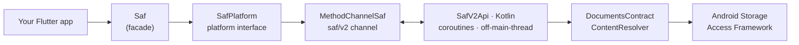

# Architecture

`saf` is a single package with a mockable platform-interface layer, a thin Dart
facade, and one coroutine-based Kotlin handler on a dedicated method channel.
The legacy 1.x channels are left completely untouched, so `LegacySaf` keeps
working with zero risk.



## Layers

| Layer | File | Responsibility |
| --- | --- | --- |
| Facade | `lib/src/v2/saf.dart` | The `Saf` class — thin delegations to the platform instance. |
| Interface | `lib/src/v2/saf_platform_interface.dart` | `SafPlatform` (mockable in tests). |
| Channel | `lib/src/v2/saf_method_channel.dart` | Marshals calls; maps errors to typed exceptions. |
| Native | `android/.../v2/SafV2Api.kt` | Coroutine handler; single-cursor `DocumentsContract` queries. |
| Streams | `android/.../v2/SafV2Streams.kt` | Per-session `EventChannel`s for read/walk/progress. |

## A grant-then-read flow

One permission prompt, reused across restarts:

```mermaid
sequenceDiagram
  participant App
  participant Saf
  participant OS as Android SAF
  App->>Saf: pickDirectory()
  Saf->>OS: ACTION_OPEN_DOCUMENT_TREE
  OS-->>Saf: tree URI (+ persisted grant)
  Saf-->>App: SafDocumentFile
  App->>Saf: list(dir.uri)
  Saf-->>App: List&lt;SafDocumentFile&gt;
  App->>Saf: readFileStream(file.uri)
  Saf-->>App: Stream&lt;Uint8List&gt;
```

## Design choices

- **Single cursor for `list`/`walk`.** One `ContentResolver.query` with a full
  projection (id, name, mime, size, modified) instead of `DocumentFile`'s
  one-query-per-property — much faster on large directories.
- **Off the main thread.** All I/O runs on `Dispatchers.IO`; results are posted
  back on the main thread.
- **Per-session event channels.** Streaming reads, `walk`, and progress each get
  a unique `EventChannel` that is torn down on completion or cancellation.
- **Stable error codes.** Kotlin maps every failure to one of
  `permission` / `not_found` / `already_exists` / `io`, which the Dart layer
  turns into the `SafException` hierarchy.

## Verified on-device

Every operation above was exercised end-to-end on a physical **Motorola Edge 40
(Android 15)**, including persisted-permission reuse across an app restart. See
`docs/testing/manual-checklist.md` in the repo for the spot-check list.
